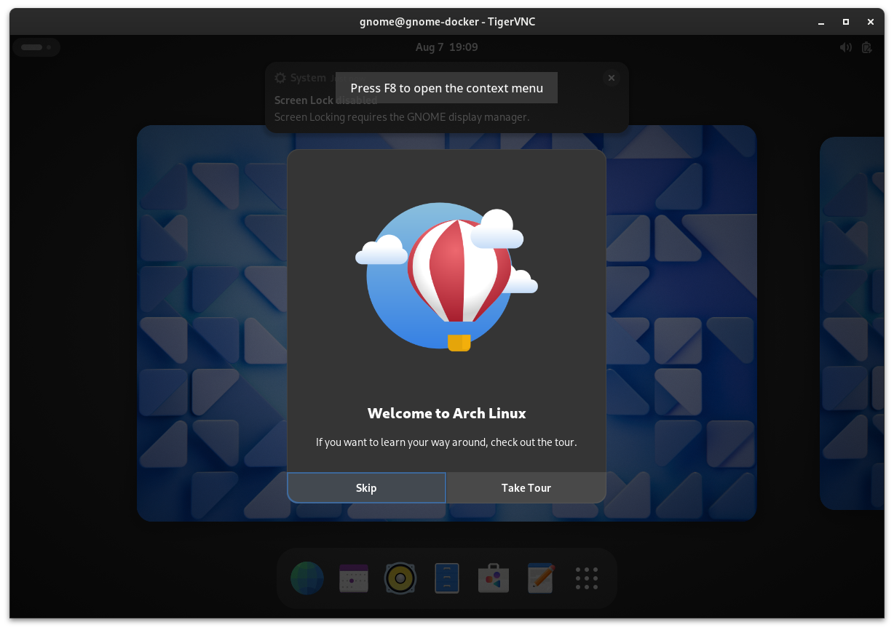

# gnome-docker

Run gnome-shell under docker container, for developing/debugging

## requirement

 - docker(compose) under systemd system
 - VNC viewer or RDP viewer (But vnc is recommended)

## Getting started

## Options

See [options](./docs/options.md)

## TODO

- [ ] GPU acceleration (Xorg)
